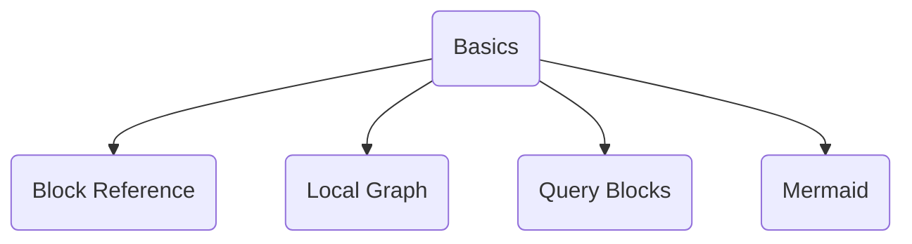
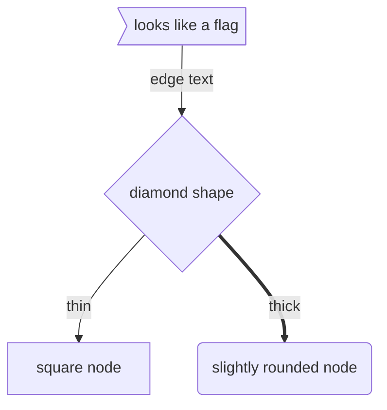

# Mermaid
Use [mermaid.js](https://mermaid-js.github.io/mermaid/#/) to create graphs and other visualizations in your markdown files.

## Usage with Obsidian links


```


The trick is `class a,b,c,d,e internal-link`
You need to enumerate your nodes and define them as internal links.

## Getting fancy with nodes and edges


```
